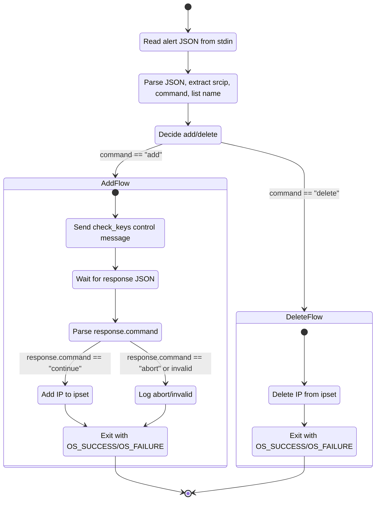

# GitHub Copilot Instructions for `wazuh-ar-ipset`

## Project overview

This project implements a **Wazuh Active Response (AR) script** that manages Linux `ipset` sets in response to Wazuh alerts.

- Language and tooling:
  - C23 (GCC/Clang with C2x/C23 extensions enabled via CMake)
  - CMake-based build (`CMakeLists.txt` at repo root)
  - `libipset` for kernel ipset manipulation
  - `libcjson` (cJSON) for JSON parsing and serialization
- Runtime environment:
  - Executed as a **Wazuh Active Response command** (typically `firewall-ipset`)
  - Launched by `wazuh-execd`, normally running as **root**
  - Receives alerts and AR control data over **stdin** and returns control messages over **stdout**
- Design:
  - **Stateful** AR script: on `add`, it may send a control message and wait for a `continue` / `abort` response before modifying ipsets; on `delete`, it reverts the previous action.
  - The program is a single short-lived process per invocation, not a daemon.

When adding or modifying code, assume:

- Input JSON from Wazuh is **trusted but not well-formed by default** (we still validate presence and shape of fields, lengths, and numeric ranges).
- The script runs as **root**, so **defensive programming and safety** matter more than micro-optimizations.

---

## Security and robustness expectations

Because this binary runs as root and talks to the kernel (`ipset`), security and robustness are the highest priorities.

- **Memory safety**
  - Prefer automatic storage (stack) and RAII-style lifetime patterns when possible.
  - Avoid unbounded buffers. Use fixed-size buffers with explicit maximums (see `MAX_BUF_SIZE` in `protocol.h`).
  - After allocations, always check for `NULL` and handle failures by logging and exiting with `OS_FAILURE`.
  - Avoid manual pointer arithmetic where standard functions (`strncpy`, `snprintf`, `memcpy` with length checks) suffice.
- **Input handling**
  - All external input comes from **stdin** JSON and must be parsed via existing helpers in `json.c`/`json.h`.
  - Do not read raw `stdin` yourself; use `read_and_parse()` from `protocol.c` so the newline and buffer-size rules stay consistent.
  - Reject malformed or incomplete JSON early with a clear `wazuh_log_message()` and `OS_FAILURE` where appropriate.
- **Privilege-aware behavior**
  - Assume the process is running as root. Any external interaction (`system()`, direct shelling out, arbitrary file I/O) must be **avoided** unless explicitly required by the project and reviewed.
  - Prefer using existing wrappers or adding **narrowly scoped** helpers instead of inlining risky operations.
- **Denial-of-service and deadlocks**
  - Always ensure that writes to `stdout` (control messages) end with a newline so Wazuh does not hang waiting for EOF.
  - Reads from `stdin` must be bounded (use `MAX_BUF_SIZE`) and treat overlong lines as an error, as done in `protocol.c`.
  - Avoid long blocking operations and unbounded loops; each invocation should complete quickly.

When in doubt, **favor clarity and explicit error paths** over cleverness.

---

## Coding style and conventions

Follow the existing style in `src/`.

- **Language level**
  - Use C23-compatible C. It is acceptable to use C2x features supported by modern GCC/Clang (e.g., attributes, `nullptr` where already present, designated initializers).
  - Do **not** introduce C++ features; this is C compiled as C, even if some files use C++-style attributes.
- **Headers and modules**
  - Add new declarations to the most appropriate existing header: `utils.h`, `json.h`, `wazuh.h`, `ipset.h`, or create a new header if strictly needed.
  - Keep function visibility narrow: prefer `static` for internal functions.
- **Error handling**
  - Use `OS_SUCCESS` and `OS_FAILURE` from `protocol.h` for return codes where applicable.
  - Log errors with `wazuh_log_message()` and either return `OS_FAILURE` or `exit(OS_FAILURE)` depending on context and existing patterns in the file.
  - For fatal initialization errors (e.g., `ipset_initialize()` failure), return failure from `main()` as currently done.
- **Naming**
  - Functions: `snake_case` with descriptive verbs, e.g., `process_add_command`, `utils_get_ip_family`.
  - Types: `struct type_name`, enums prefixed with a component name (e.g., `enum ar_command`).
  - Globals: prefix with a clear namespace (e.g., `g_program_name`).
- **Logging**
  - Use `wazuh_log_message(const char *fmt, ...)` for any diagnostic or error messages, reusing phrasing similar to existing code.
- **Formatting**
  - Follow the current brace and indentation style in `src/`.
  - Avoid unrelated refactors or reformatting when modifying a file.

---

## Strict rules for AI-generated changes

The following rules are **mandatory** for GPT-5.1 and Claude 4.5+ when generating or editing code in this repository.

- **Stdout and protocol**
  - MUST only print JSON protocol messages to `stdout` (plus a trailing `"\n"`).
  - MUST NOT print debug or log text to `stdout`; use `wazuh_log_message()` instead.
  - MUST use `read_and_parse()` for all JSON input from `stdin`.
  - MUST use `json_build_control_message()` + `send_control_message()` for control messages, or extend these helpers instead of bypassing them.
- **Process and OS interactions**
  - MUST NOT introduce calls to `system()`, `popen()`, `fork()`, `exec*()`, `posix_spawn()`, or similar process-creation APIs.
  - MUST NOT introduce network I/O, listening sockets, or long-lived background threads/processes.
  - MUST NOT add arbitrary file I/O outside the project’s expected log or configuration paths without an explicit requirement.
  - MUST assume the effective user ID is `root` and MUST NOT attempt to drop or change privileges (`setuid`, `setgid`, capabilities, etc.) unless explicitly requested.
- **Memory and error handling**
  - MUST check the result of any allocation (`malloc`, `calloc`, etc.) and handle `NULL` by logging and failing fast.
  - MUST check return values of internal helpers (e.g., `ipset_add_ip`, `ipset_del_ip`, `json_*`, `utils_*`) and propagate or log errors.
  - MUST use `OS_SUCCESS` / `OS_FAILURE` from `protocol.h` for conventional success/failure returns where applicable.
- **Scope of changes**
  - MUST keep changes minimal and localized to the requested behavior.
  - MUST NOT rename public functions, change public signatures, or move files unless explicitly requested.
  - SHOULD prefer adding small helpers over large refactors when new functionality is needed.

---

## Wazuh AR protocol: message flow and state diagram

This binary implements the **stateful Active Response protocol** as documented by Wazuh.

### Message types

- **Alert message (stdin → script)**
  - JSON with structure similar to:
    - `version`: integer
    - `origin`: object with `name`, `module`
    - `command`: string, typically `"add"` or `"delete"`
    - `parameters`: object, including (at least)
      - `alert`: full alert JSON, including `data.srcip` or similar IP field
      - `extra_args`: array of **two** strings (REQUIRED):
        - index 0: ipset name for IPv4 addresses
        - index 1: ipset name for IPv6 addresses
      - `program`: string name of the AR executable
- **Control message (stdout ← script)**
  - Sent only for **stateful** AR flows when `command == "add"`.
  - Structure:
    ```json
    {
      "version": 1,
      "origin": {
        "name": "<program-name>",
        "module": "active-response"
      },
      "command": "check_keys",
      "parameters": {
        "keys": ["<srcip-or-other-keys>"]
      }
    }
    ```
  - This is built in `json_build_control_message()` and printed by `send_control_message()`.
- **Response message (stdin → script)**
  - Wazuh replies to the control message with a JSON object such as:
    ```json
    {
      "version": 1,
      "origin": {
        "name": "<manager-or-agent>",
        "module": "wazuh-execd"
      },
      "command": "continue" | "abort",
      "parameters": {}
    }
    ```

### High-level state machine

The state machine is driven by the `command` field in the **initial alert message** and, for `add`, by the `command` field of the **response message**. The following Mermaid state diagram captures the main flow:



More concretely, in terms of functions:

- `main()`
  - Calls `read_and_parse()` to get the **alert JSON** (`input`).
  - Uses `json_get_srcip()`, `utils_get_ip_family()`, and `utils_get_list_name()` to derive `srcip` and target ipset name.
  - Uses `json_get_command()` + `utils_parse_command()` to map the `command` string into `enum ar_command`.
  - Dispatches to:
    - `process_add_command(ipset_handle, srcip, list_name)` for `AR_COMMAND_ADD`.
    - `process_delete_command(ipset_handle, srcip, list_name)` for `AR_COMMAND_DELETE`.
- `process_add_command()` (in `commands.c`)
  - Calls `send_control_message(srcip)` to write a **control message** to stdout.
  - Calls `read_and_parse()` again to read the **response message**.
  - Extracts the response `command` string and maps it via `utils_parse_command()`.
  - If `AR_COMMAND_CONTINUE`:
    - Calls `ipset_add_ip(handle, set_name, ip)` and returns `OS_SUCCESS`/`OS_FAILURE`.
  - If `AR_COMMAND_ABORT`:
    - Logs "Aborted" and returns `OS_SUCCESS` (no change to ipset).
  - Otherwise:
    - Logs "Unknown confirmation command" and returns `OS_FAILURE`.
- `process_delete_command()`
  - Directly calls `ipset_del_ip(handle, set_name, ip)` and returns `OS_SUCCESS`/`OS_FAILURE`.

### Protocol-specific guardrails for Copilot

When generating or modifying protocol-related code:

- Always ensure **exactly one line** is printed per JSON message and it ends with `"\n"`.
- Never print extra debug text to stdout; use `wazuh_log_message()` (stderr or log file) instead.
- Use `json_build_control_message()` + `send_control_message()` for control messages; do not handcraft JSON strings unless extending that helper.
- Use `read_and_parse()` for all incoming JSON messages and validate the `command` field with `utils_parse_command()`.

---

## Local API surface for LLMs

When generating code, prefer these existing APIs over inventing new ones:

- **Protocol and JSON**
  - `cJSON* read_and_parse(void)`: MUST be used to read one JSON message from `stdin` with size and newline checks.
  - `void send_control_message(const char* srcip)`: MUST be used to send the `check_keys` control message to `stdout`.
  - `const char* json_get_srcip(const cJSON* input)`: SHOULD be used to obtain the source IP from the alert JSON.
  - `const char* json_get_command(const cJSON* input)`: SHOULD be used to get the `command` string (`"add"`, `"delete"`, `"continue"`, `"abort"`).
  - `char* json_build_control_message(const char* program_name, cJSON* keys)`: MUST be used to build the JSON control message; it takes ownership of `keys`.
- **Utility helpers**
  - `int utils_get_ip_family(const char* ip_str)`: MUST be used to determine IP family (e.g., AF_INET / AF_INET6 style) and validate IP format.
  - `const char* utils_get_list_name(const cJSON* input, int family)`: MUST be used to determine the target ipset name based on alert JSON and IP family.
  - `enum ar_command utils_parse_command(const char* command)`: MUST be used to translate command strings into `AR_COMMAND_*` enum values.
- **IP set manipulation**
  - `struct ipset* ipset_initialize(void)`: MUST be used to create the ipset handle before any `ipset_*` operations.
  - `void ipset_finalize(struct ipset* handle)`: MUST be used to clean up the ipset handle (it is safe to call with `NULL`).
  - `int ipset_add_ip(struct ipset* handle, const char* set_name, const char* ip)`: MUST be used to add an IP to a set; check for `0` (success).
  - `int ipset_del_ip(struct ipset* handle, const char* set_name, const char* ip)`: MUST be used to delete an IP from a set; check for `0` (success).
- **Wazuh logging and lifecycle**
  - `void wazuh_initialize(void)`: MUST be called once at startup before using `wazuh_log_message`.
  - `void wazuh_finalize(void)`: MUST be called at exit (directly or via `atexit`) to release Wazuh resources.
  - `void wazuh_log_message(const char* format, ...)`: MUST be used for all logs and errors instead of `printf`/`fprintf`.

If new functionality requires extending this API surface, prefer adding a small, well-named helper in the appropriate module (`json.c`, `utils.c`, `ipset.c`, `wazuh.c`) and updating the corresponding header.

---

## Using CMake and dependencies

- Build system:
  - The project uses a root `CMakeLists.cpp` to configure targets.
  - New source files should be added to the relevant target in `CMakeLists.txt`.
- Dependencies:
  - `libipset` is used via `ipset.h` abstractions; invoke `ipset_add_ip()` / `ipset_del_ip()` rather than calling into libipset directly from unrelated code.
  - `libcjson` is wrapped by helpers in `json.c`/`json.h`. Prefer these helpers over raw cJSON calls where they exist.

If you introduce new third-party dependencies, keep them **minimal and justified**, and wire them through CMake in a way consistent with how `libipset` and `cJSON` are handled.

---

## Performance expectations

Performance matters, but **correctness, security, and clarity** are higher priority than nanosecond-level tuning.

- The script is short-lived per alert, so we avoid heavy allocations or repeated initialization, but we do not micro-optimize.
- It is acceptable to pay small costs (extra bounds checks, clearer data structures) in exchange for safer, more maintainable code.
- Avoid premature optimization; if you optimize, add brief context in a comment or commit message.

---

## How Copilot should behave in this repo

When generating code for this project, Copilot should:

1. **Respect the AR protocol**
   - Use the existing JSON and protocol helpers instead of rolling custom stdin/stdout logic.
   - Preserve the stateful `add` → control-message → response → `continue`/`abort` flow.
2. **Prefer safety and explicitness**
   - Check return values, null pointers, and lengths.
   - Log meaningful error messages via `wazuh_log_message()`.
3. **Integrate with existing abstractions**
   - Use `ipset_*`, `json_*`, and `utils_*` APIs already defined.
   - Extend headers and C files in line with their current responsibilities.
4. **Avoid expanding scope unnecessarily**
   - Do not add unrelated features (config files, CLIs, network calls, etc.) unless explicitly requested.

These instructions are intended to guide GitHub Copilot and other AI coding assistants toward safe, protocol-correct, and maintainable contributions to this project.