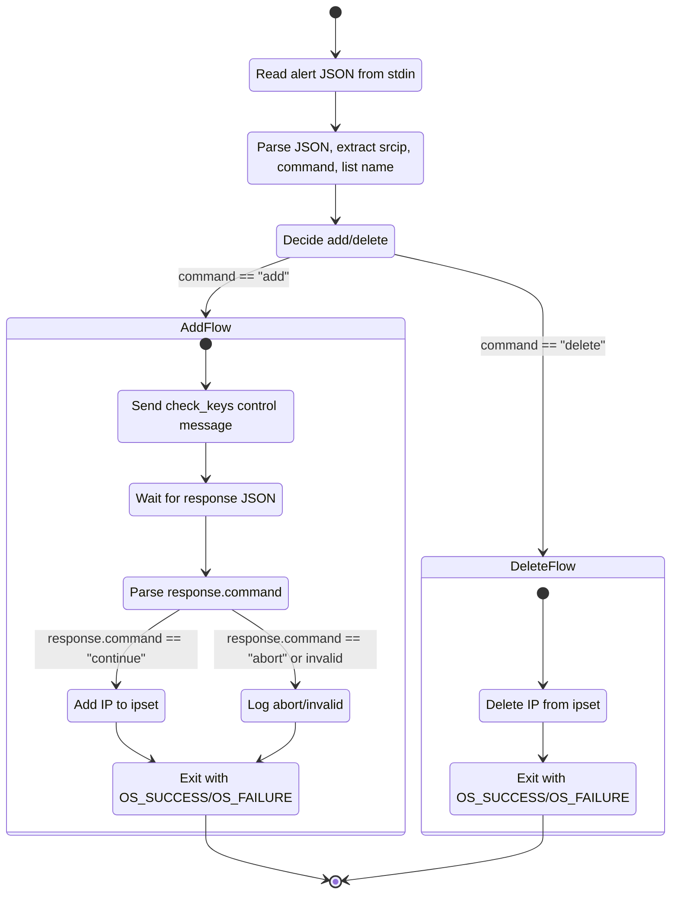

# wazuh-ar-ipset

Stateful Wazuh Active Response (AR) script that manages Linux `ipset` sets based on Wazuh alerts.

- Language: C23 (via CMake)
- Dependencies: `libipset`, `libcjson` (cJSON)
- Environment: executed by `wazuh-execd`, typically as `root`, on Wazuh agents.

This project is designed to be **safe first** (it runs as root and talks to the kernel) and **fast enough**, but not micro‑optimized.

## What it does

- Reads a Wazuh Active Response JSON message from `stdin`.
- Extracts the source IP from the alert and resolves the target ipset name using `parameters.extra_args` (IPv4/IPv6 sets).
- Implements the **stateful AR protocol**:
  - For `command: "add"`:
    - Sends a `check_keys` control message with the IP back to Wazuh over `stdout`.
    - Waits for a response with `command: "continue"` or `"abort"`.
    - On `continue`, adds the IP to the configured ipset.
    - On `abort`, logs and exits without modifying ipsets.
  - For `command: "delete"`:
    - Deletes the IP from the configured ipset.

All interaction with ipsets is done via `libipset` through a small wrapper layer in `src/ipset.*`.

## Building

This project uses CMake and assumes `libipset` and `libcjson` development packages are installed.

On a typical Debian/Ubuntu‑like system you might need (names may vary by distro):

```bash
sudo apt-get update
sudo apt-get install -y libipset-dev libcjson-dev cmake build-essential
```

Configure and build:

```bash
cd /workspaces/wazuh-ar-ipset  # or your clone path
cmake -S . -B build
cmake --build build --clean-first -v
```

The resulting binary (for example `firewall-ipset`) should appear in the `build/` directory.

## Installing into Wazuh

On the Wazuh **agent** where you want to run this AR:

1. Copy the built binary into the agent active‑response directory (adjust path and name as needed):

  ```bash
  sudo install -o root -g wazuh -m 750 build/firewall-ipset /var/ossec/active-response/bin/firewall-ipset
  ```

2. On the Wazuh **manager**, configure the command and active response in `/var/ossec/etc/ossec.conf` (simplified example). Note that the command is expected to run as `root` so that `ipset` operations succeed:

  ```xml
  <ossec_config>
    <command>
      <name>firewall-ipset</name>
      <executable>firewall-ipset</executable>
      <timeout_allowed>yes</timeout_allowed>
      <!-- extra_args[0] = IPv4 set, extra_args[1] = IPv6 set (space-separated) -->
      <extra_args>ar-ipset-v4 ar-ipset-v6</extra_args>
    </command>

    <active-response>
      <disabled>no</disabled>
      <command>firewall-ipset</command>
      <location>local</location>
      <!-- adjust rule IDs / groups as needed -->
      <rules_id>12345</rules_id>
      <timeout>600</timeout>
    </active-response>
  </ossec_config>
  ```

3. Restart Wazuh components to apply changes:

  ```bash
  sudo systemctl restart wazuh-agent
  sudo systemctl restart wazuh-manager
  ```

Please adapt names, rule IDs, and timeouts to your environment.

### Creating ipset sets

Before using this Active Response, you must create the ipset sets referenced in `extra_args` (for example, `ar-ipset-v4` and `ar-ipset-v6`). Run the following commands on the Wazuh agent as `root`:

```bash
# IPv4 set (hash of IPv4 addresses)
sudo ipset create ar-ipset-v4 hash:ip family inet

# IPv6 set (hash of IPv6 addresses)
sudo ipset create ar-ipset-v6 hash:ip family inet6
```

These commands create two simple hash-based sets suitable for blocking IP addresses. Adjust the names and ipset options (e.g., `timeout`, `maxelem`) as needed for your environment.

## Wazuh Active Response protocol

This binary follows Wazuh’s **stateful Active Response** pattern. For full details, see the official documentation:

- Wazuh docs: [Custom Active Response scripts](https://documentation.wazuh.com/current/user-manual/capabilities/active-response/custom-active-response-scripts.html)

Key points:

- Input is a single JSON object per invocation, read from `stdin`.
- For stateful ARs, the script can send a `check_keys` control message and must wait for Wazuh’s response (`continue` / `abort`).
- Each JSON message exchanged is sent as a single line terminated by `\n`.
 - `parameters.extra_args` MUST be an array of two elements:
   - index 0: ipset name used for IPv4 addresses
   - index 1: ipset name used for IPv6 addresses

### State diagram

The following Mermaid state diagram summarizes the main stateful AR flow implemented by this binary:



## Testing locally

You can exercise the binary locally by piping a sample AR JSON message into it. This does **not** fully emulate Wazuh, but is useful to verify parsing and basic error handling.

1. Build the project (see **Building** above), then from the repo root create a minimal two-line test file. This example uses placeholder ipset names `ar-ipset-v4` and `ar-ipset-v6` that should already exist on the system:

  ```bash
  cat > sample-add.json << 'EOF'
  {"version":1,"origin":{"name":"test-agent","module":"wazuh-execd"},"command":"add","parameters":{"extra_args":["ar-ipset-v4","ar-ipset-v6"],"alert":{"data":{"srcip":"192.0.2.10"}},"program":"firewall-ipset"}}
  {"version":1,"origin":{"name":"test-manager","module":"wazuh-execd"},"command":"continue","parameters":{}}
  EOF
  ```

   - **Line 1** is the alert message with `command: "add"`.
   - **Line 2** is the simulated Wazuh response with `command: "continue"`.

2. Run the binary as `root`, feeding it both JSON messages via `stdin`:

  ```bash
  sudo ./build/firewall-ipset < sample-add.json
  ```

   The program will:
   - Read line 1 (alert), parse it, and print a `check_keys` control message to `stdout`.
   - Read line 2 (response), see `command: "continue"`, and attempt to add the IP to the configured ipset.

3. To test the `delete` path, create a similar one-line file, for example:

  ```bash
  echo '{"version":1,"origin":{"name":"test-agent","module":"wazuh-execd"},"command":"delete","parameters":{"extra_args":["ar-ipset-v4","ar-ipset-v6"],"alert":{"data":{"srcip":"192.0.2.10"}},"program":"firewall-ipset"}}' > sample-delete.json
  sudo ./build/firewall-ipset < sample-delete.json
  ```

   In this case, the program will directly attempt to remove the IP from the configured ipset and then exit.
